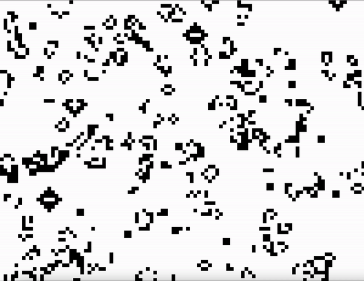
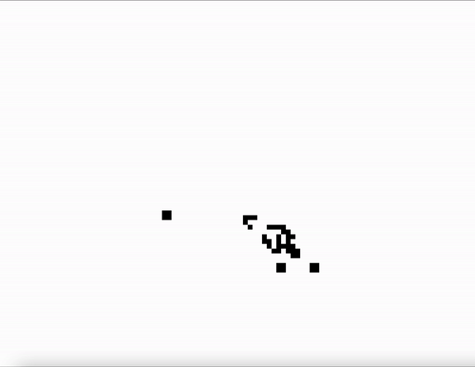
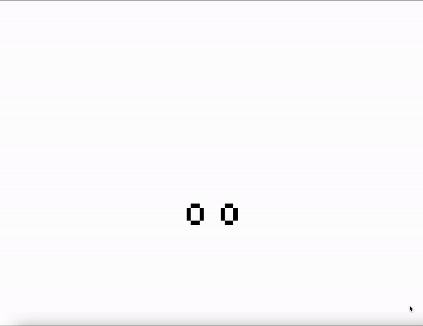

<p align="center">
  <a href="" rel="noopener">
 </a>
</p>

<h3 align="center">Conway's game of life</h3>

---

<p align="center"> This is a recreation of Conway's game of life
    <br> This project uses java to recreate Conway's game of life and can be used to simulate the game of life with 3 different initial configurations
</p>

## 📝 Table of Contents

- [About](#about)
- [Getting Started](#getting_started)
- [Usage](#usage)
- [Built Using](#built_using)
- [Authors](#authors)

## 🧐 About <a name = "about"></a>

The Game of Life, also known simply as Life, is a cellular automaton devised by the British mathematician John Horton Conway in 1970.It is a zero-player game,[2][3] meaning that its evolution is determined by its initial state, requiring no further input. One interacts with the Game of Life by creating an initial configuration and observing how it evolves. It is Turing complete and can simulate a universal constructor or any other Turing machine. [Wikipedia]


## 🏁 Getting Started <a name = "getting_started"></a>

These instructions will get you a copy of the game so that you can improve it or simulate it on your machine to see it play out on your machine

### Prerequisites

- Java JDK

### Installing

If you do not have Java installed on your computer, install the latest JDK from here.  

```
Step 1: Install the latest Java JDK from [here](https://www.oracle.com/java/technologies/downloads)
```

## 🎈 Usage <a name="usage"></a>

Once Java are installed, verify that java and javac have been installed. You can do this from the terminal
```
java --version
javac --version
```
If you do not see the version number, then you have not installed Java properly.  

To compile run: 
```
javac Life.java
```
To simulate run: 
```
java Life n m x
```

Where - n is the number of iterations that the program runs for
        m is the size of the square grid
        x is the pattern type to initialize the grid with (P = Penta-decathlon Oscillator, S = Simkin glider gun, R = Random) 

### Random Pattern


### Simkin glider gun pattern


### Penta-decathlon Oscillator pattern


## ⛏️ Built Using <a name = "built_using"></a>

- Java

## ✍️ Authors <a name = "authors"></a>
- [@nssherif](https://github.com/nssherif) 
